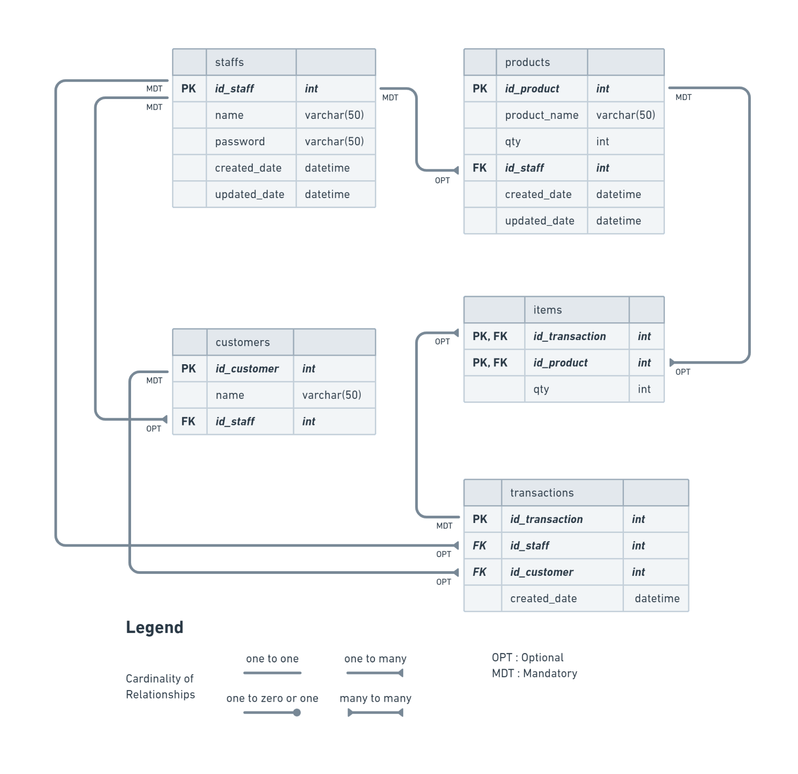

# Tokoku App

Tokoku is a CLI based point-of-sales app built with Golang and MySQL.


## Table Of Content

- [Features of the App](#features-of-the-app)
- [Future Improvements](#future-improvements)
- [Entity Relationship Diagram (ERD)](#entity-relationship-diagram-erd)
- [Folder Structure Pattern](#folder-structure-pattern)
- [Requirements](#Requirements)
- [How to Install](#how-to-install)
- [Credit](#credit)


## Features of the App

  There are 2 level users, Admin and Staff, each level user has different menu, here are the features of each level user :
  
   - Staff menu :\
      :white_check_mark: Login as Staff\
      :white_check_mark: Insert a new transaction\
      :white_check_mark: Show history transactions\
      :white_check_mark: Insert a new product\
      :white_check_mark: Show all the products\
      :white_check_mark: Update product information and stock\
      :white_check_mark: Insert a new customer\
      :white_check_mark: Show all customers data\
      :white_check_mark: Update customer information
  
  - Admin menu :\
      :white_check_mark: Login as Admin\
      :white_check_mark: Register a new staff account\
      :white_check_mark: Show and delete a product\
      :white_check_mark: Show history transaction and delete transaction\
      :white_check_mark: Show and delete a customer\
      :white_check_mark: Show and delete a staff\
      :white_check_mark: Update staff account information

## Future Improvements

- [x] A better deleting system
- [x] Product & transaction price


## Entity Relationship Diagram (ERD)



## Folder Structure Pattern
```
├── config
│   └── config.go
└── customer
│   └── customer.go
└── product
│   └── product.go
└── staff
│   └── staff.go
└── transaction
│   └── transaction.go
├── .gitignore
├── ERD.png
├── go.mod
├── go.sum
├── LICENSE
├── local.env.example
├── main.go
├── README.md
└── tokoku-script.sql
```

## Requirements
- Go v1.19
- MySQL v8.x

## How to Install

- Clone it

```
$ git clone [https://github.com/teamseven-dev/tokoku.git]
```


- Go to directory

```
$ cd tokoku
```


- Delete .git

```
$ rm -rf .git
```


- Install packages

```
$ go get github.com/joho/godotenv
```

```
$ go get github.com/go-sql-driver/mysql
```

- Create a new database and execute `sql-script.sql` on it

- Rename `local.env.example` to `local.env` and adjust the content of it as your environment settings

- Run the project

```
$ go run .
```


## Credit
[Indra Darmawan](https://github.com/e1more)

[Kharisma Januar Muhammad JN](https://github.com/kharismajanuar)

[Muhammad Habibullah](https://github.com/hebobibun)


<p align="right" style="padding: 5px; border-radius: 100%; background-color: red; font-size: 2rem;">
  <b><a href="#tokoku-app">BACK TO TOP</a></b>
</p>
